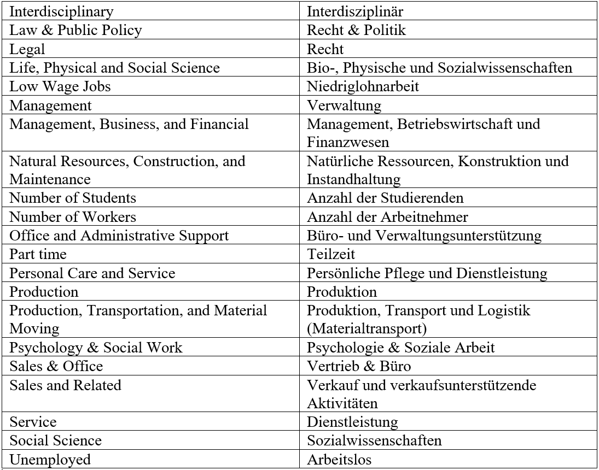

## Der amerikanische Arbeitsmarkt und das Phänomen "Gender Pay Gap"
Mit dem High-School-Abschluss in der Tasche beginnt für viele junge Amerikaner ein ganz neuer Lebensabschnitt: das College. Dort können sie anhand eines sehr breitgefächerten Studienangebots ihre weitere Zukunft planen. Doch gibt es eigentlich Unterschiede zwischen Männern und Frauen innerhalb der Studienfächer? Und wie sieht es nach dem College aus? Unterscheiden sich die Arbeitszeiten und der Brutto-Lohn innerhalb der Branchen? Im Folgenden wird gezeigt, wie sich Studienfach, Arbeitszeit und der Lohn bei Männern und Frauen unterscheiden. Da es sich um englischsprachige Datensätze handelt, ist am Ende dieses Artikels ein Glossar beigefügt, in dem die Jobkategorien und weitere Begriffe ins Deutsche übersetzt wurden. 

```{r setup, include=FALSE}
knitr::opts_chunk$set(warning = FALSE, echo = FALSE)
#install.packages("gridExtra")
library(tidyverse)
library(lubridate)
library(ggplot2)
library(esquisse)
library(gridExtra)
library(here)
library(DT)

# Daten überall anpassen
```


```{r echo=FALSE, message=FALSE, warning=FALSE, paged.print=FALSE}
jobs_gender <- readr::read_csv("https://raw.githubusercontent.com/rfordatascience/tidytuesday/master/data/2019/2019-03-05/jobs_gender.csv")
earnings_female <- readr::read_csv("https://raw.githubusercontent.com/rfordatascience/tidytuesday/master/data/2019/2019-03-05/earnings_female.csv") 
employed_gender <- readr::read_csv("https://raw.githubusercontent.com/rfordatascience/tidytuesday/master/data/2019/2019-03-05/employed_gender.csv") 


college_major <- readr::read_csv("recent-grads.csv")

rwthcolors <- hcictools::rwth.colorpalette()

```

### College Abschlüsse in den USA nach Geschlecht
Als Erstes stellt sich natürlich die Frage, ob Männer und Frauen die gleichen Fächer belegen oder ob es Unterschiede bei den einzelnen Studienschwerpunkten gibt. Werfen wir mal einen genaueren Blick darauf: 


```{r Diagramme I College Major nach Kategorie und Geschlecht; female und male workers nach major category, echo=FALSE, fig.height=5, fig.width=9}

college_major %>%
  filter(Major_category != "Agriculture & Natural Resources") %>% 
  select(Men, Women, Major_category) %>% 
  gather(gender, value, -Major_category) %>% 
  group_by(Major_category, gender) %>% 
  summarize(total = sum(value)) %>%
  ungroup() %>% 
  ggplot() +
  aes(x = Major_category, y = total, fill = gender) + geom_col() + coord_flip() +
  theme(axis.text  =element_text(size=10)) +
  scale_y_continuous(labels = scales::comma_format(big.mark = ".", decimal.mark = ",")) +
  scale_fill_manual(values = c(rwthcolors$blue, rwthcolors$red)) +
  labs(title = "Die meisten Abschlüsse gibt es im Business Sektor",
       subtitle = "Balkendiagramm von Abschluss nach Geschlecht",
       x = "Major Category",
       y = "Number Of Students (absolute)",
       fill = "Legend")
```

###Geschlechterverteilung am amerikanischen Arbeitsmarkt
Gehen wir nun einen Schritt weiter und schauen uns an, wie die Arbeitsverhältnisse in Amerika aussehen. In Anlehnung an das erste Diagramm ist hier sehr deutlich zu erkennen, dass Jobs in denen hauptsächlich Männer arbeiten eher einen technischen Schwerpunkt haben, genau wie in den Studienfächern zuvor. Frauen hingegen arbeiten eher im Gesundheitswesen, der Lehre oder im medialen Bereich. Der Business- und Finanzsektor hingegen ist ausgeglichener.

```{r Diagramm 2, fig.height=5, fig.width=10}

jobs_gender %>% select(major_category, minor_category, workers_male, workers_female) %>% 
  gather(gender, value, -major_category, -minor_category) %>% 
  group_by(major_category, gender) %>% 
   summarize(total = sum(value)) %>% 
  ungroup() %>% 
  ggplot() +
  aes(x = major_category, y = total, fill = gender) + geom_col() + coord_flip() +
  theme(axis.text  =element_text(size=11)) +
  scale_fill_manual(name = "Legend", labels = c("Women", "Men"), values = c(rwthcolors$red, rwthcolors$blue)) +
  labs(title = "Sales und Office beschäftigt die meisten Arbeitnehmer",
       subtitle = "Balkendiagramm von Job-Kategorie nach Geschlecht",
       x = "Major Category",
       y = "Number Of Workers (absolute)",
       fill = "Legend") +
  scale_y_continuous(labels = scales::comma_format(big.mark = ".", decimal.mark = ","))
  


```

#### Zwischenfazit
Die Aufteilung der Geschlechter auf bestimmte Arbeitsbereiche beginnt schon im College. Bereits dort differenziert sich sehr deutlich heraus, für welche Fachrichtungen sich Männer und Frauen entscheiden. Der Bereich "Business" ist von beiden Geschlechtern sehr ausgeglichen belegt, während "Engineering" und "Computer & Mathematics" eher von Männern und die Bereiche „Education“, „Psychology & Social Work“ und „Humanities & Library Arts“ eher von Frauen dominiert werden.
Dementsprechend zieht sich dieser rote Faden auch durch den Arbeitsmarkt. Die typischen Klischees, dass Frauen eher im kreativen Sektor und Männer eher im technischen und mathematischen Bereich arbeiten, werden an dieser Stelle bestätigt. Neutrale Sektoren bleiben sowohl im College als auch im späteren Job der Business-, Vertriebs- und Service-Sektor.
Allerdings gilt es nicht außer Acht zu lassen, dass angehende Studierende die freie Wahl bei ihren Studienfächern haben. Frauen könnten dementsprechend genauso einen technischen Schwerpunkt wählen, wie Männer einen kreativen. 


### Was nützt mir mein College-Abschluss im Job?
Nach dem College geht es für die frisch gebackenen Absolventen zunächst einmal auf Jobsuche. Wir haben zuvor zwar gesehen, aus welchen Aspekten sich der amerikanische Arbeitsmarkt zusammensetzt, aber wer arbeitet im Endeffekt eigentlich wirklich in einem Job, in dem sein Abschluss eine Voraussetzung ist?


```{r College Jobs, Non College Jobs, Low Wage Jobs}

college_major %>% 
 select(Major_category, College_jobs, Non_college_jobs, Low_wage_jobs) %>% 
  gather(variable, value, -Major_category) %>%
  group_by(Major_category, variable) %>% 
   summarize(total = sum(value)) %>% 
  ungroup() %>% 
  ggplot() +
  aes(x = variable, y = total, fill = variable) + 
  geom_bar(stat = "identity", position = "dodge") +
  theme_minimal() +
  scale_fill_manual(name = "Legend", labels = c("College Jobs", "Low Wage Jobs", "Non College Jobs"), values = c(rwthcolors$maygreen, rwthcolors$yellow, rwthcolors$lightblue)) +
  labs(title = "Die meisten Absolventen arbeiten in Non College Jobs",
       subtitle = "Balkendiagramm von Arbeit nach Kategorie",
       x = "Job Category",
       y = "Number Of Workers") +
  scale_x_discrete(name = "Job Category", labels = c("College Jobs", "Low Wage Jobs", "Non College Jobs")) +
  scale_y_continuous(labels = scales::comma_format(big.mark = ".", decimal.mark = ","))

```

#### Zwischenfazit
Die Mehrheit der Arbeitnehmer hat einen Job, für den sie ihren College-Abschluss nicht benötigt hätten. Sie hätten also auch ohne eine teure und langjährige Ausbildung die gleiche Arbeit erledigen können. Nur knapp über 300.000 Arbeitnehmer arbeiten in einem Bereich, in der ihr College-Abschluss vorausgesetzt war. Immerhin arbeiten jedoch die wenigsten Absolventen in unter- bzw. schlechtbezahlten Jobs. Durch höhere Bildungsabschlüsse haben die jungen Leute also sehr gute Chancen auf einen angemessen bezahlten Arbeitsplatz.

### Voll- und Teilzeit auf dem amerikanischen Arbeitsmarkt
Nachdem unsere jungen Amerikaner ihre ersten Schritte in der Berufswelt gegangen sind, stellt sich noch die Frage, inwieweit sich die Beschäftigungsverhältnisse von weiblichen und männlichen Arbeitnehmern unterscheiden. Es hält sich auch hier in der Allgemeinheit das Klischee, dass Frauen häufiger in Teilzeit arbeiten als Männer, um sich um Familie und Haushalt kümmern zu können. Aber wer weiß, vielleicht hat sich in den letzten Jahrzehnten etwas auf dem Arbeitsmarkt verändert. Schauen wir uns das mal genauer an:


```{r}

college_major %>% 
  select(Full_time, Part_time, Unemployed) %>% 
  gather(variable, value) %>%
  group_by(variable) %>%  
  summarize(total = sum(value)) %>% 
  ggplot() +
  aes(x = variable, y = total, fill = variable) + 
  geom_bar(stat = "identity", position = "dodge") +
  theme_minimal() +
  scale_fill_manual(name = "Legend", labels = c("Full Time", "Part Time", "Unemployed"), values = c(rwthcolors$turquois, rwthcolors$orange, rwthcolors$violet)) +
  scale_y_continuous(labels = scales::comma_format(big.mark = ".", decimal.mark = ",")) +
  labs(title = "Das Verhältnis zwischen Vollzeit, Teilzeit und arbeitslos",
       subtitle = "Balkendiagramm",
       x = "Type of Work",
       y = "Number Of Workers (absolute)") +
  scale_x_discrete(name = "Type of Work", labels = c("Full Time", "Part Time", "Unemployed"))
```

Tatsächlich arbeiten mehr Angestellte in Vollzeit als in Teilzeit. Die Arbeitslosigkeit ist vergleichsweise gering. Aber wie sieht der Unterschied bei den Geschlechtern aus? Das folgende Diagramm zeigt noch einmal die Aufteilung von Vollzeit und Teilzeit nach Geschlecht sortiert aus dem Jahr 2013:


```{r full-time und part-time Vergleich, echo=FALSE, message=FALSE, warning=FALSE}


employed_gender %>% 
  filter(year == 2013) %>% 
  select(-starts_with("total")) %>% 
  gather(variable, value, -year) %>%
  mutate(gender = case_when(
    str_detect(variable, "female") ~ "Female",
    str_detect(variable, "male") ~ "Male"),
    type_of_work = case_when(
    str_detect(variable, "part") ~ "Part Time",
    str_detect(variable, "full") ~ "Full Time")) %>%  
  ggplot() +
  aes(x = gender, y = value, fill = type_of_work) + 
  geom_bar(stat = "identity", position = "dodge") +
  theme_minimal() +
   scale_fill_manual(values = c(rwthcolors$turquois, rwthcolors$orange)) +
  labs(title = "Verhältnis von Vollzeit und Teilzeit",
       subtitle = "Balkendiagramm von Arbeitsverhältnis nach Geschlecht",
       x = "Gender",
       y = "Number Of Workers (in percent)",
       fill = "Legend")
  

employed_gender %>% 
  select(-starts_with("total")) %>% 
  gather(variable, value, -year) %>%
  mutate(gender = case_when(
    str_detect(variable, "female") ~ "Female"),
    type_of_work = case_when(
    str_detect(variable, "part") ~ "Part Time",
    str_detect(variable, "full") ~ "Full Time")) %>%  
  ggplot() +
  aes(x = year, y = value, fill = type_of_work) + 
 geom_smooth() +
  labs(title = "Kaum Veränderung bei Beschäftigungsverhältnissen von Frauen",
       subtitle = "Liniendiagramm der Frauen von Jahren nach Beschäftigunsverhältnis",
       x = "Year",
       y = "Number Of Female Workers (in percent)",
       fill = "Legend")

```

#### Zwischenfazit
Generell arbeiten ca. 2/3 der Arbeitnehmer in Vollzeit, während ca. 1/3 in Teilzeit arbeiten. Die Arbeitslosenquote hingegen ist eher gering. Schaut man jedoch auf die Verteilung von Voll- und Teilzeit nach Geschlechtern ergeben sich deutlichere Unterschiede. Bei den weiblichen Arbeitnehmern arbeiten 75 % in Voll- und 25% in Teilzeit, bei den männlichen über 80% in Vollzeit. Auch über die letzten 50 Jahre hinweg hat sich die Verteilung bei Frauen von Voll- und Teilzeit nicht nennenswert verändert. Nach 2010 stieg die Anzahl an Teilzeitbeschäftigungen leicht, während die Vollzeitbeschäftigung leicht abnahm.


## Wer verdient eigentlich was?
Kommen wir nun zu einer Kategorie, die für viele Arbeitnehmer einer der wichtigsten überhaupt ist: das Gehalt. Auch hier gibt es geschlechtliche Unterschiede. Zunächst beschäftigen wir uns aber mit den Gehaltsklassen, die je nach Jobrichtung variieren. Denn ein College-Abschluss zu haben, garantiert einem noch nicht einen ausreichenden Verdienst um damit monatlich über die Runden zu kommen. Schauen wir also auf die allgemeinen Gehälter, die unsere jungen Arbeitnehmer zu erwarten haben. Die folgende Tabelle ist interaktiv und du kannst dich selbstständig durch sie durchklicken und nach bestimmten Studiengängen suchen.


### "Mama, ich werde Ingenieur"


```{r}

college_major %>% select(Rank, Major, Major_category, Median) %>% mutate(Major = str_to_title(Major)) %>% 
  datatable(caption = "Test", rownames = F, colnames = c("Rang", "Studiengang", "Studienkategorie", "Durchschnittsgehalt (in Dollar)")) 

  

```
Tabelle 1: angelehnt an "The Economic Guide of Picking a College Major"


####Zwischenfazit
Die besten Brutto-Jahres-Gehälter verdient man in Amerika im Bereich „Engineering“, die schlechtesten in „Education“ und „Psychology & Work“. Erinnert ihr euch noch an das erste Diagramm, das die Belegung der Studienfächer nach Geschlecht angezeigt hat? Männer waren vor allem in „Engineering“ und in technischen Studienfächern vertreten, Frauen hingegen in Bildungs- und sozialorientierten Studienfächern. Frauen tendieren also schon von Beginn an zu schlechter bezahlten Berufsfeldern.


###Gender Pay Gap
Bevor wir uns nun mit den Gehältern beschäftigen, die Männer und Frauen im Einzelnen zu erwarten haben, folgt zunächst eine kleine Exkursion in die Politik der Gleichberechtigung. Es geht um den „Gender Pay Gap“, der den prozentualen Brutto-Gehaltsunterschied zwischen Männern und Frauen erklärt. Dieser besagt, dass Frauen im Durchschnitt weniger verdienen als Männer, trotz gleicher Arbeit. In Amerika wurde dazu in den 1980er Jahren die Red Purse Camapagne gegründet, die auf die roten Zahlen in Geldbörsen der Frauen hinweist. In Deutschland wurde dazu der"Equal Pay Day" eingeführt. Dieser besagt, dass Frauen 77 Tage im Jahr umsonst arbeiten, da sie im Schnitt weniger verdienen. Der nächste Equal Pay Day fällt auf den 17. März 2020. Dieser markiert den Tag, bis zu dem die Frauen umsonst arbeiten, während die Männer schon ab dem 01. Januar ihr Gehalt beziehen. Inwieweit diese Gehaltsunterschiede existieren (oder nicht existieren) lässt sich anhand der Daten aus dem Jahre 2013 ablesen:

```{r fig.height=5, fig.width=10}

jobs_gender %>% 
  filter(year == 2013, minor_category!= "Transportation", minor_category!= "Protective Service", minor_category!= "Material Moving", minor_category!= "Installation, Maintenance, and Repair", minor_category!="Healthcare Practitioners and Technical", minor_category!= "Construction and Extraction") %>% 
  select(minor_category, year, total_earnings, total_earnings_male, total_earnings_female) %>% 
  gather(gender, value, -year, -minor_category, -total_earnings) %>% 
  group_by (minor_category, gender) %>% 
  summarise_at(vars (-minor_category, -gender), funs(mean))  %>% 
   mutate(major_category = fct_reorder(minor_category, gender)) %>% 
  ungroup() %>% 
  ggplot() +
  aes(x = minor_category, y= value, fill = gender) +
  coord_flip() +
  geom_bar(stat = "identity", position = "dodge") +
  theme(axis.text  =element_text(size=11)) +
   scale_fill_manual(name = "Legend", labels = c("Women", "Men"), values = c(rwthcolors$red, rwthcolors$blue)) +
  scale_y_continuous(labels = scales::comma_format(big.mark = ".", decimal.mark = ",")) +
  labs(title = "Gender Pay Gap",
       subtitle = "Balkendiagramm von Arbeitskategorie und Gehalt nach Geschlecht",
       x = "Major Category",
       y = "Brutto Earnings per Year (in Dollar)")


```

```{r echo=FALSE, fig.height=5, fig.width=9}

compute_diff <- function(x){
  max(x) - min(x)
}

jobs_gender %>% 
  filter(year == 2013, minor_category!= "Transportation", minor_category!= "Protective Service", minor_category!= "Material Moving", minor_category!= "Installation, Maintenance, and Repair", minor_category!="Healthcare Practitioners and Technical", minor_category!= "Construction and Extraction") %>% 
  select(minor_category, year, total_earnings, total_earnings_male, total_earnings_female) %>% 
  gather(gender, value, -year, -minor_category, -total_earnings) %>% 
  group_by (minor_category, gender) %>% 
  summarise_at(vars (value, -minor_category, -gender), funs(mean)) %>% 
  summarise(difference = compute_diff(value)) %>% 
  ungroup() %>% 
 ggplot() +
  aes(x = minor_category, y= difference) +
  coord_flip() +
  geom_bar(stat = "identity", fill = c(rwthcolors$bordeaux)) +
  scale_y_continuous(labels = scales::comma_format(big.mark = ".", decimal.mark = ",")) +
  theme(axis.text = element_text(size=11))  +
  labs(title = "Differenz der Gehaltszahlungen",
       subtitle = "Balkendiagramm der Differenz",
       x = "Major Category",
       y = "Difference per Year (in Dollar)")

  
  

```


####Zwischenfazit
Was zu allererst ins Auge fällt: Auch wenn der blaue und der rote Balken sehr nahe beieinanderliegen, so ist der Blaue überall (!) länger als der Rote. Frauen verdienen also auch im gleichen Arbeitsbereich weniger als Männer. Besonders ausgeprägt ist dies in den Feldern „Management“, „Legal“ und „Life, Physical and Social Science“. Dort verdienen Frauen im Jahr durschnittlich knapp 15.000 Dollar weniger. Etwas angeglichener ist es in „Personal Care and Service“ und „Food Preparation and Service Related“. Dort beläuft sich der Gender Pay Gap auf wenige 1.000 Dollar im Jahr. Trotzdem ist deutlich zu erkennen, dass Frauen weniger verdienen als Männer. 


## Fazit
Bereits im College gibt es bei der Belegung der Studienfächer Unterschiede zwischen Männern und Frauen. Die Daten zeigen einen technischen Schwerpunkt bei Männern und einen Sozialen bei Frauen. Dennoch gibt es auch ausgeglichene Studienfächer, zum Beispiel im Bereich „Business“. Diese geschlechtliche Aufteilung zeigt sich dementsprechend auch auf dem Arbeitsmarkt. Hinzu kommt, dass mehr Frauen in Teilzeit arbeiten, als Männer und dass sich dies auch in den letzten 50 Jahren nicht nennenswert verändert hat. Männer verdienen im Vergleich zu Frauen außerdem mehr Geld, was unterschiedliche Gründe hat: Zum einen arbeiten mehr von ihnen in Vollzeit, zum anderen entscheiden sie sich eher für besser bezahlte Berufsfelder. Doch auch innerhalb der gleichen Arbeitssektoren haben männliche Arbeitnehmer am Ende des Jahres mehr Geld auf dem Konto, als ihre weiblichen Mitstreiterinnen. Es gilt jedoch zu beachten, dass Frauen die freie Wahl bei dem Schwerpunkt ihres Studiums haben und dass keine Frau gezwungen wird weniger Stunden zu arbeiten (wodurch natürlich der Lohn auch sinkt). Ebenfalls zu berücksichtigen ist, dass es innerhalb des gleichen Arbeitssektors unterschiedlich bezahlte Positionen gibt. Dennoch scheint es so, dass vor allem Männer diese höheren Positionen belegen. Die Daten haben also erhebliche Unterschiede zwischen Männern und Frauen in der Arbeitswelt gezeigt. Damit sich jedoch daran etwas ändern kann, müssen Frauen auf sich Aufmerksam machen, sich auch in männerdomminierte Arbeitsbereiche trauen und ihr Können unter Beweis stellen. 


###Quellen

Die Daten für die Diagramme stammen aus dem "Tidy Tuesday" (https://github.com/rfordatascience/tidytuesday, zuletzt aufgerufen am 10.07.2019):

* College Major & Income (im Tidy Tuesday erschienen: 16.10.2018)
https://www.census.gov/programs-surveys/acs/data/pums.html (zuletzt aufgerufen am: 10.07.2019)

* Women in the Workplace (im Tidy Tuesday erschienen: 5.3.2019)
https://www.census.gov/data/tables/time-series/demo/industry-occupation/median-earnings.html (zuletzt aufgerufen am 10.07.2019)
   + Bureau of Labor Statistics, U.S. Department of Labor, The Economics Daily, Women’s earnings, 1979–2011 on the Internet at https://www.bls.gov/opub/ted/2012/ted_20121123.htm (zuletzt aufgerufen am 10.07.2019).
   + Bureau of Labor Statistics, U.S. Department of Labor, The Economics Daily, Percentage of employed women working full time little changed over past 5 decades on the Internet at https://www.bls.gov/opub/ted/2017/percentage-of-employed-women-working-full-time-little-changed-over-past-5-decades.htm (zuletzt aufgerufen am 10.07.2019).

* https://www.equalpayday.de/ueber-epd/ (zuletzt aufgerufen am 10.07.2019)

* Tabelle 1:
https://fivethirtyeight.com/features/the-economic-guide-to-picking-a-college-major/ (zuletzt aufgerufen am 10.07.2019)

### Anhang




