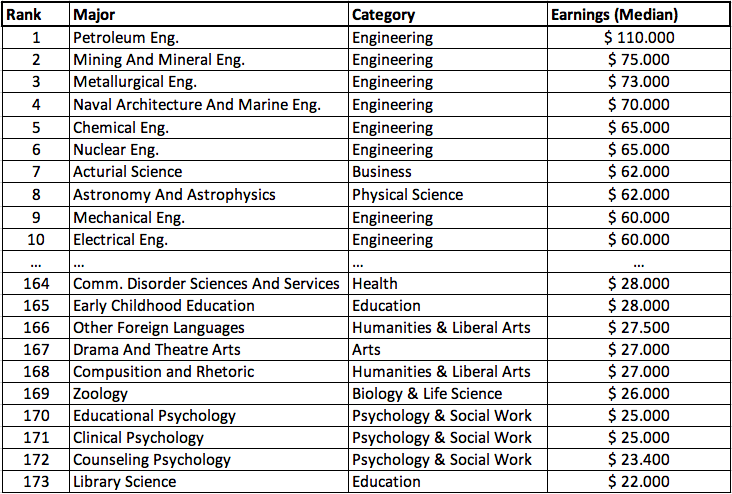

##College Abschlüsse in den USA und das Phänomen "Gender Pay Gap"
Wenn man die hohen Kosten eines Studiums in den USA berücksichtigt, muss sich ein Studierender dort gut entscheiden in welches Berufsfeld er oder sie einsteigen möchte. Mit welchem Abschluss man gute Jobchancen und die Aussicht auf eine gute Bezahlung hat, wird hier aufgezeigt. Aber nicht nur die Wahl des Studienfaches ist zu berücksichtigen, sondern auch die gleichberechtigte Bezahlung zwischen Männern und Frauen. 
Das Phänomen "Gender Pay Gap" erklärt den prozentualen Brutto-Gehaltsunterschied zwischen Männer und Frauen. Dieser besagt, dass Frauen im Durchschnitt weniger verdienen, als Männer, trotz gleicher Arbeit. In Amerika wurde dazu in den 1980er Jahren die Red Purse Camapagne gegründet, die auf die roten Zahlen in Geldbörsen der Frauen hinweist. In Deutschland wurde dazu der "Equal Pay Day" eingeführt. Dieser besagt, dass Frauen 77 Tage im Jahr umsonst arbeiten, da sie im Schnitt weniger verdienen. Der nächste Equal Pay Day fällt auf den 17. März 2020. Dieser markiert den Tag, bis zu dem die Frauen umsonst arbeiten, während Männer schon ab dem 01. Januar Gehalt bekommen. 
```{r setup, include=FALSE}
knitr::opts_chunk$set(warning = FALSE, echo = FALSE)
#install.packages("gridExtra")
library(tidyverse)
library(lubridate)
library(ggplot2)
library(esquisse)
library(gridExtra)
library(here)
library(DT)


```


```{r echo=FALSE, message=FALSE, warning=FALSE, paged.print=FALSE}
jobs_gender <- readr::read_csv("https://raw.githubusercontent.com/rfordatascience/tidytuesday/master/data/2019/2019-03-05/jobs_gender.csv")
earnings_female <- readr::read_csv("https://raw.githubusercontent.com/rfordatascience/tidytuesday/master/data/2019/2019-03-05/earnings_female.csv") 
employed_gender <- readr::read_csv("https://raw.githubusercontent.com/rfordatascience/tidytuesday/master/data/2019/2019-03-05/employed_gender.csv") 


college_major <- readr::read_csv("recent-grads.csv")

rwthcolors <- hcictools::rwth.colorpalette()

```
### College Abschlüsse und Arbeitsbereiche nach Geschlecht
Der Datensatz "College Major & Income" soll vorbeugend auf Studierende in den USA wirken, denn ein College Abschluss heißt nicht, dass man eine Jobgarantie hat. Aber wie man seinen Abschluss aussucht, kann vorbeugend auf diese Situation wirken. Die Auswahl des Studienfaches scheint essentiell zu sein. Wer im Bereich Engineering studiert, hat bessere Chancen auf einen gut bezahlten Job, als Studierende, die sich für den Art Bereich entscheiden. Aber wer studiert hier eigentlich was? Oft gibt es einen großen Unterschied zwischen Männern und Frauen in den Studienfächern. 

```{r Diagramme I College Major nach Kategorie und Geschlecht; female und male workers nach major category, echo=FALSE, fig.height=5, fig.width=9}

college_major %>%
  filter(Major_category != "Agriculture & Natural Resources") %>% 
  select(Men, Women, Major_category) %>% 
  gather(gender, value, -Major_category) %>% 
  group_by(Major_category, gender) %>% 
  summarize(total = sum(value)) %>%
  ungroup() %>% 
  ggplot() +
  aes(x = Major_category, y = total, fill = gender) + geom_col() + coord_flip() +
  scale_y_continuous(labels = scales::comma_format(big.mark = ".", decimal.mark = ",")) +
  scale_fill_manual(values = c(rwthcolors$blue, rwthcolors$red)) +
  labs(title = "Die meisten Abschlüsse gibt es im Business Sektor",
       subtitle = "Balkendiagramm von Abschluss nach Geschlecht",
       x = "Major Category",
       y = "Value (absolute)",
       fill = "Legend")
```

```{r Diagramm 2, fig.height=5, fig.width=10}

jobs_gender %>% select(major_category, minor_category, workers_male, workers_female) %>% 
  gather(gender, value, -major_category, -minor_category) %>% 
  group_by(major_category, gender) %>% 
   summarize(total = sum(value)) %>% 
  ungroup() %>% 
  ggplot() +
  aes(x = major_category, y = total, fill = gender) + geom_col() + coord_flip() +
  scale_fill_manual(name = "Legend", labels = c("Women", "Men"), values = c(rwthcolors$red, rwthcolors$blue)) +
  labs(title = "Sales/Office sind bei Arbeitnehmern beliebt",
       subtitle = "Balkendiagramm von Job Kategorie nach Geschlecht",
       x = "Major Category",
       y = "Value (absolute)",
       fill = "Legend") +
  scale_y_continuous(labels = scales::comma_format(big.mark = ".", decimal.mark = ","))
  


```

#### Ergebnisanalyse I
Hier kommt das erste Zwischenfazit. Keyfindings I: Business Sektor relativ ausgegleichen, ebenso sozialer Bereich. Technischer Bereich eher Männer; Gesundheit, Psychologie eher Frauen.
Keyfindings II: Business und Service sehr ausgeglichen; Produktion, Construction Work und Technik eher Männer; Gesundhei, Kunst und Medien eher Frauen.

### Wie sieht es in den Kategorien nach dem College aus?
Erklärtext und so weiter.

```{r College Jobs, Non College Jobs, Low Wage Jobs}

college_major %>% 
 select(Major_category, College_jobs, Non_college_jobs, Low_wage_jobs) %>% 
  gather(variable, value, -Major_category) %>%
  group_by(Major_category, variable) %>% 
   summarize(total = sum(value)) %>% 
  ungroup() %>% 
  ggplot() +
  aes(x = variable, y = total, fill = variable) + 
  geom_bar(stat = "identity", position = "dodge") +
  theme_minimal() +
  scale_fill_manual(name = "Legend", labels = c("College Jobs", "Low Wage Jobs", "Non College Jobs"), values = c(rwthcolors$lightblue, rwthcolors$yellow, rwthcolors$maygreen)) +
  labs(title = "Die meisten Absolventen arbeiten in Non College Jobs",
       subtitle = "Balkendiagramm von Arbeit nach Kategorie",
       x = "Jobs",
       y = "Value (absolute)") +
  scale_x_discrete(name = "Jobs", labels = c("College Jobs", "Low Wage Jobs", "Non College Jobs")) +
  scale_y_continuous(labels = scales::comma_format(big.mark = ".", decimal.mark = ","))

```

#### Zwischenfazit
Kaum Unterschied zwischen College und Non-College Jobs. Deutlicher Unterschied zu Low-Wage Jobs. Es arbeiten also weniger Absolventen im Low Wage Bereich. 

### Wie ist das Verhältnis von Voll- zu Teilzeit? Und wie sieht das nach Geschlecht aufgeteilt aus?
Eine Teilzeit Anstellung wirkt auf den ersten Blick sehr attraktiv, so hat man mehr Zeit für andere Dinge. Ob wirklich so viele Menschen eine Teilzeit Beschäftigung haben, als eine Vollzeit, können wir hier sehen. 
Gesellschaftlich wird häufig behauptet, Frauen würden deutlich mehr in Teilzeit arbeiten, als Männer. Immerhin müsste sich ja irgendwer um die Familie kümmern. Aber stimmt das? Immerhin ist seit einigen Jahren zu beobachten, dass Frauen genauso auf Karriere aus sind, wie Männer und ihnen ein guter Job in Vollzeit ebenso wichtig ist. Schauen wir uns das mal genauer an. 

```{r}

college_major %>% 
  select(Full_time, Part_time, Unemployed) %>% 
  gather(variable, value) %>%
  group_by(variable) %>%  
  summarize(total = sum(value)) %>% 
  ggplot() +
  aes(x = variable, y = total, fill = variable) + 
  geom_bar(stat = "identity", position = "dodge") +
  theme_minimal() +
  scale_fill_manual(name = "Legend", labels = c("Full Time", "Part Time", "Unemployed"), values = c(rwthcolors$turquois, rwthcolors$orange, rwthcolors$violet)) +
  scale_y_continuous(labels = scales::comma_format(big.mark = ".", decimal.mark = ",")) +
  labs(title = "Das Verhältnis zwischen Vollzeit, Teilzeit und arbeitslos",
       subtitle = "Balkendiagramm",
       x = "Type of Work",
       y = "Value (absolute") +
  scale_x_discrete(name = "Type of Work", labels = c("Full Time", "Part Time", "Unemployed"))
```

Tatsächlich arbeiten mehr Angestellte in Vollzeit als in Teilzeit. Die Arbeitslosigkeit ist vergleichsweise gering. Aber wie sieht der Unterschied bei den Geschlechtern aus?

```{r full-time und part-time Vergleich}


employed_gender %>% 
  filter(year == 2013) %>% 
  select(-starts_with("total")) %>% 
  gather(variable, value, -year) %>%
  mutate(gender = case_when(
    str_detect(variable, "female") ~ "Female",
    str_detect(variable, "male") ~ "Male"),
    type_of_work = case_when(
    str_detect(variable, "part") ~ "Part Time",
    str_detect(variable, "full") ~ "Full Time")) %>%  
  ggplot() +
  aes(x = gender, y = value, fill = type_of_work) + 
  geom_bar(stat = "identity", position = "dodge") +
  theme_minimal() +
   scale_fill_manual(values = c(rwthcolors$turquois, rwthcolors$orange)) +
  labs(title = "Verhältnis von Vollzeit und Teilzeit",
       subtitle = "Balkendiagramm von Arbeitsverhältnis nach Geschlecht",
       x = "Gender",
       y = "Value (in percent)",
       fill = "Legend")
  

# Das macht dann eher wenig Sinn? Full-time und part-time hat sich bei Frauen über die Jahre nicht verändert.
employed_gender %>% 
  select(-starts_with("total")) %>% 
  gather(variable, value, -year) %>%
  mutate(gender = case_when(
    str_detect(variable, "female") ~ "Female"),
    type_of_work = case_when(
    str_detect(variable, "part") ~ "Part Time",
    str_detect(variable, "full") ~ "Full Time")) %>%  
  ggplot() +
  aes(x = year, y = value, fill = type_of_work) + 
 geom_smooth() +
  labs(title = "Kaum Veränderung bei Beschäftigungsverhältnissen bei Frauen",
       subtitle = "Liniendiagramm von Jahren, Geschlecht und Beschäftigunsverhältnis",
       x = "Year",
       y = "Value (in percent)",
       fill = "Legend")

```

#### Zwischenanalyse II
Wir können sehen, dass Frauen tatsächlich häufiger in Teilzeit arbeiten, als Männer - nämlich 25% Frauen im Vergleich zu knapp 13% der Männer. 
Über die Jahre hat sich die Prozentzahl von Frauen in Voll- und Teilzeit aber kaum verändert. nach 2010 stieg die Anzahl an Teilzeit Beschäftigungen leicht, während die Vollzeit Beschäftigung leicht abnahm. 


### Median vom Gehalt
 
 
 


```{r}

college_major %>% select(Rank, Major, Major_category, Median) %>% mutate(Major = str_to_title(Major)) %>% 
  datatable(caption = "Test", rownames = F, colnames = c("Rang", "Studiengang", "Studienkategorie", "Durchschnittsgehalt (in Dollar)")) 

  

```


### Gender Pay Gap
Schauen wir uns mal genauer an, was es mit dem Gender Pay Gap so auf sich hat. Ist das alles nur ein medial verbreitetes Problem? 
So sah es 2013 in den USA aus. 

Man sieht in den Oberkategorien schon einen Unterschied in der Bezahlung. Zu drei gibt es keine Daten vom Verdienst der Frauen. Wie das in den Unterkategorien aussieht, schauen wir uns jetzt an:

  
```{r fig.height=5, fig.width=9}

jobs_gender %>% 
  filter(year == 2013, minor_category!= "Transportation", minor_category!= "Protective Service", minor_category!= "Material Moving", minor_category!= "Installation, Maintenance, and Repair", minor_category!="Healthcare Practitioners and Technical", minor_category!= "Construction and Extraction") %>% 
  select(minor_category, year, total_earnings, total_earnings_male, total_earnings_female) %>% 
  gather(gender, value, -year, -minor_category, -total_earnings) %>% 
  group_by (minor_category, gender) %>% 
  summarise_at(vars (-minor_category, -gender), funs(mean))  %>% 
   mutate(major_category = fct_reorder(minor_category, gender)) %>% 
  ungroup() %>% 
  ggplot() +
  aes(x = minor_category, y= value, fill = gender) +
  coord_flip() +
  geom_bar(stat = "identity", position = "dodge") +
   scale_fill_manual(name = "Legend", labels = c("Women", "Men"), values = c(rwthcolors$red, rwthcolors$blue)) +
  scale_y_continuous(labels = scales::comma_format(big.mark = ".", decimal.mark = ",")) +
  labs(title = "Gender Pay Gap",
       subtitle = "Balkendiagramm von Arbeitskategorie nach Geschlecht",
       x = "Major Category",
       y = "Earnings (in Dollar)")
```

#### Ergebnis
Es gibt oft einen deutlichen Unterschied in der Bezahlung von Männern und Frauen. Frauen verdienen oft weniger. Im Pflegebereich ist es fast ausgeglichen, aber auch dort verdienen Frauen weniger. 
